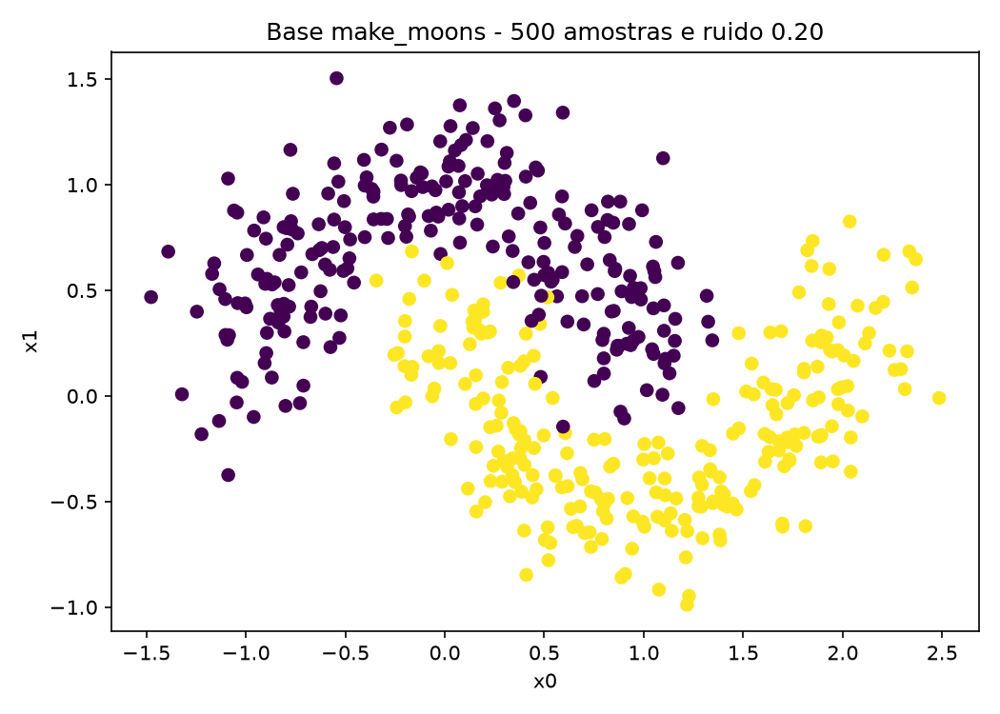
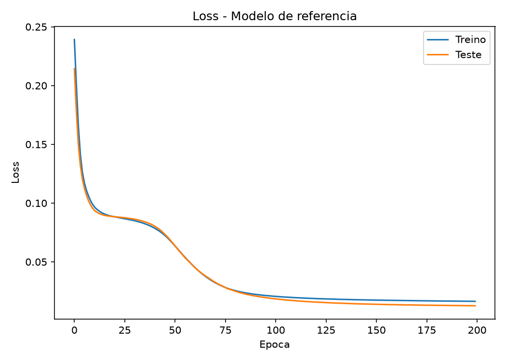
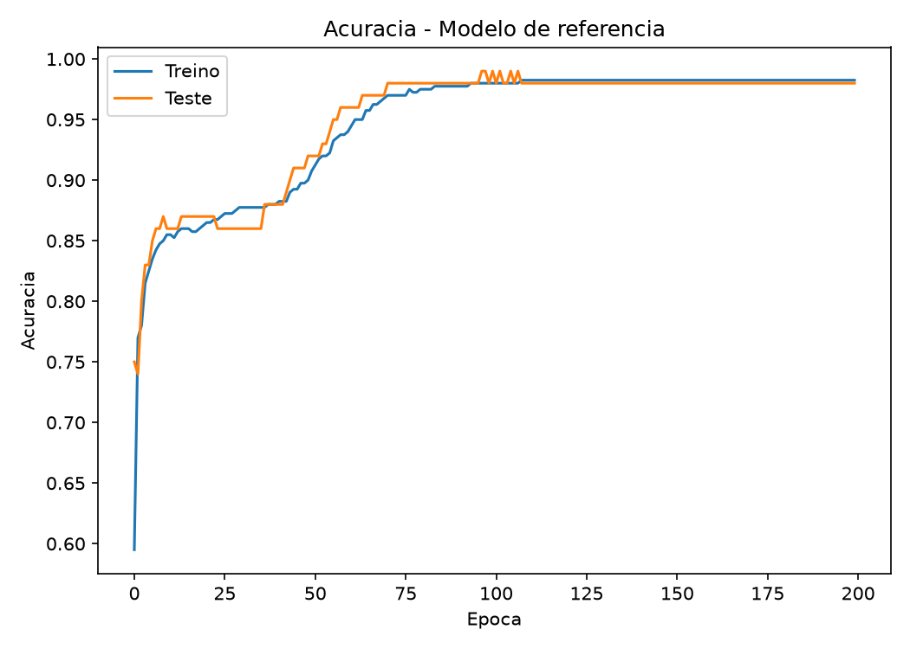
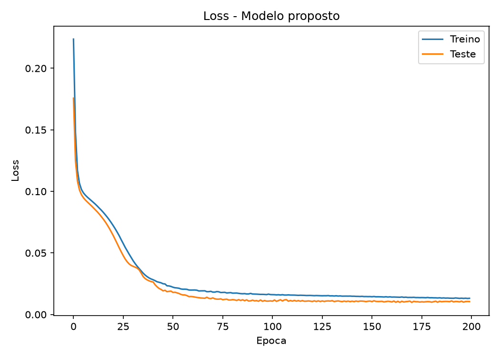
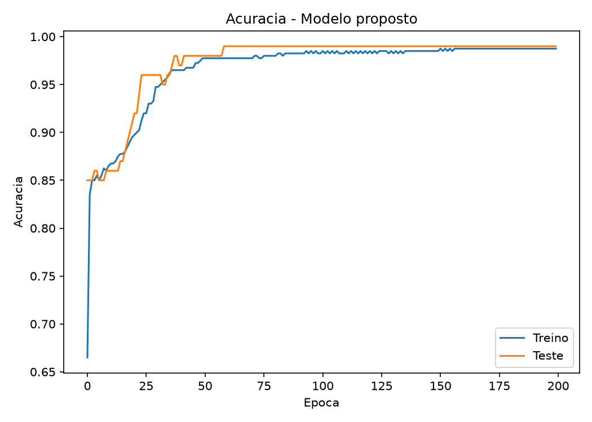
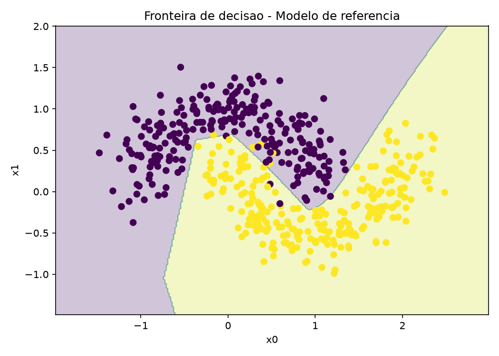
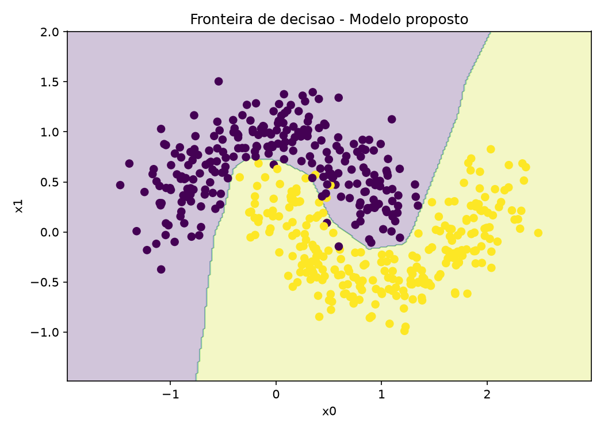

# Resultados - Redes Neurais (make_moons)

Gerado automaticamente por `src/trabalho_rede_neural.py` em 23/09/2026 21:59 Hora oficial do Brasil.
TensorFlow 2.22.0-rc0 / Keras 3.16.0.dev2026092318 (CPU - versoes diferentes podem variar ~1pp mesmo com seed fixa).

## Objetivo

Ver como mudar numero de neuronios, numero de camadas e funcoes de
ativacao da rede do `exemplo4.py` afeta a classificacao nao linear das
duas luas (`make_moons`).

## Parametros (src/config.py)

- SEED=42 | amostras=500 | ruido=0.2 | split treino/teste=80/20 estratificado (treino=400, teste=100)
- Otimizador=SGD lr=0.1 | loss=mean_squared_error | epocas=200 | batch=10

## Referencia x proposto - qual a diferenca?

| Aspecto | Referencia (exemplo4.py) | Proposto |
|---|---|---|
| Camadas ocultas | 2 (5 + 5 neuronios) | 3 (16 + 8 + 4 neuronios) |
| Ativacoes ocultas | ReLU, tanh | ReLU, ReLU, tanh |
| Saida | 1 sigmoid (binaria) | 1 sigmoid (binaria) |
| Parametros treinaveis | 51 | 225 (~4.4x mais) |

A unica mudanca proposital e a capacidade da rede: mais neuronios, uma
camada oculta a mais e ReLU nas duas primeiras camadas. Otimizador,
loss, taxa de aprendizado, epocas e dados sao identicos, entao qualquer
diferenca de desempenho vem da arquitetura.

## Base usada

## Tabela de resultados (teste)

| Modelo | Arquitetura | Params | Loss teste | Acuracia teste |
|---|---|---:|---:|---:|
| Referencia | 5 ReLU -> 5 tanh -> 1 sigmoid | 51 | 0.012633 | 98.00% |
| Proposto | 16 ReLU -> 8 ReLU -> 4 tanh -> 1 sigmoid | 225 | 0.010526 | 99.00% |

O modelo proposto ficou 1.00 ponto(s) percentual(is) acima em acuracia.

## Convergencia (calculado do historico, nao "no olho")

| Metrica | Referencia | Proposto |
|---|---|---|
| 1a epoca com loss de teste <= 0.02 | 95 | 46 |
| 1a epoca com acuracia de teste >= 95% | 58 | 24 |
| Loss final treino / teste | 0.0164 / 0.0126 | 0.0132 / 0.0105 |
| Menor loss de teste no treino | 0.0126 | 0.0098 |

O modelo maior converge cerca de 2x mais rapido (atinge o patamar de
loss com metade das epocas), o esperado para uma rede com mais
parametros sob o mesmo SGD. Em nenhum dos dois a loss de teste termina
acima da de treino, entao nao ha sinal de overfitting.

### Curvas - referencia

### Curvas - proposto

## Fronteiras de decisao

### Referencia

### Proposto

As duas fronteiras acompanham o formato das luas. A diferenca aparece
perto do cruzamento entre as classes (x0 entre -0.5 e 0), onde o modelo
proposto faz uma transicao mais abrupta - provavelmente ai que se
concentra a diferenca de acuracia.

## Conclusao

Rede maior converge mais rapido, mas nao garante acuracia melhor: neste
run a diferenca foi de 1 ponto(s) percentual(is) em 100 amostras de
teste. Para este problema e este nivel de ruido, a rede simples do
exemplo da aula ja e suficiente - capacidade extra so deixa o modelo um
pouco mais sensivel ao ruido perto da fronteira.

## Arquivos brutos

- `resultados.csv` - mesma tabela em CSV
- `historico_referencia.csv` / `historico_proposto.csv` - loss/acc por epoca (auditoria da tabela acima)
- `../modelos/referencia.keras` / `../modelos/proposto.keras` - pesos salvos
